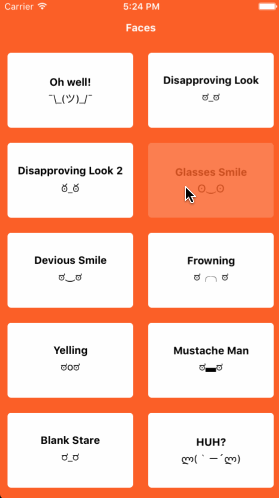

#  Textables

* Reverse engineering the [Textables App](https://github.com/OTGApps/Textables) using React-Native
* Current functionality: Displays all textables and allows the user to copy the textable via tapping on it
* Last updated 6/23/2018

## :arrow_up: How to Setup

**Step 1:** git clone this repo:

**Step 2:** cd to the cloned repo:

**Step 3:** Install the Application with `npm install`

## :arrow_forward: How to Run App

1. cd to the repo
2. Run Build for either OS
  * for iOS
    * run `react-native run-ios`
  * for Android
    * Run Genymotion
    * run `react-native run-android`

## :calling: Demo on iOS

